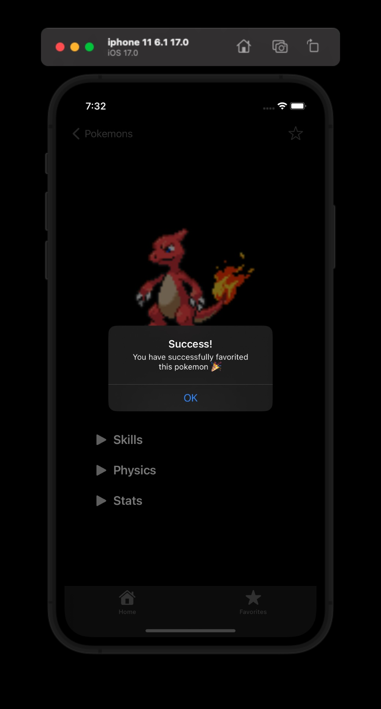

# Pokemon-Universe-Case-Project

With this application, you can view pokemons, view details, and add them to favorites. You can see the details, video and screenshots below.

## About
* MVVM pattern
* Programmatic UI with no storyboards
* No external dependencies
* Image Caching with NSCache
* Dispatch group
* Concurrency (async/await)
* Pagination
* Dark & Light mode support
* Generic and clean network layers with sublayers
* Auto layout
* UserDefaults
* Network layer unit tested
* Modularized views for clean code
* No memory leak

## API
[PokeAPI](https://pokeapi.co)

## Video
https://github.com/oemurlu/Pokemon-Universe-Case/assets/102610734/59ab86ac-8777-4395-b0e3-82c58149a5c1

## Screenshots

